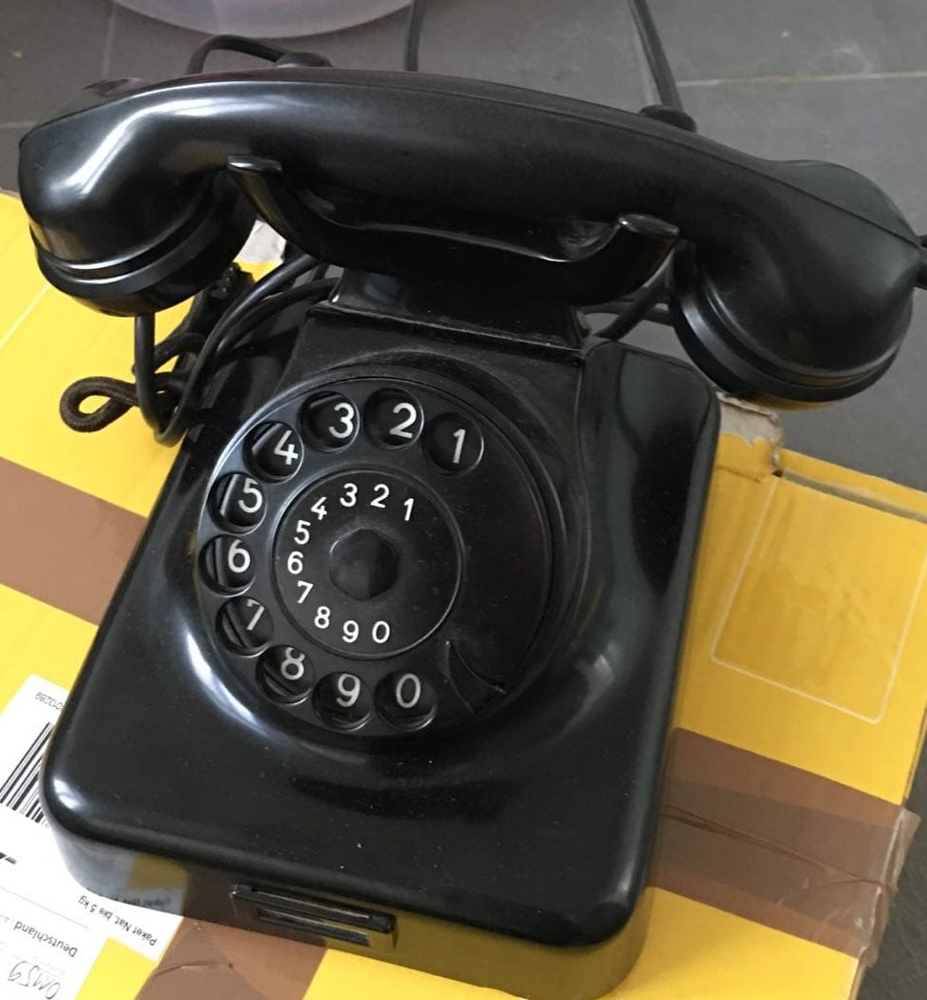
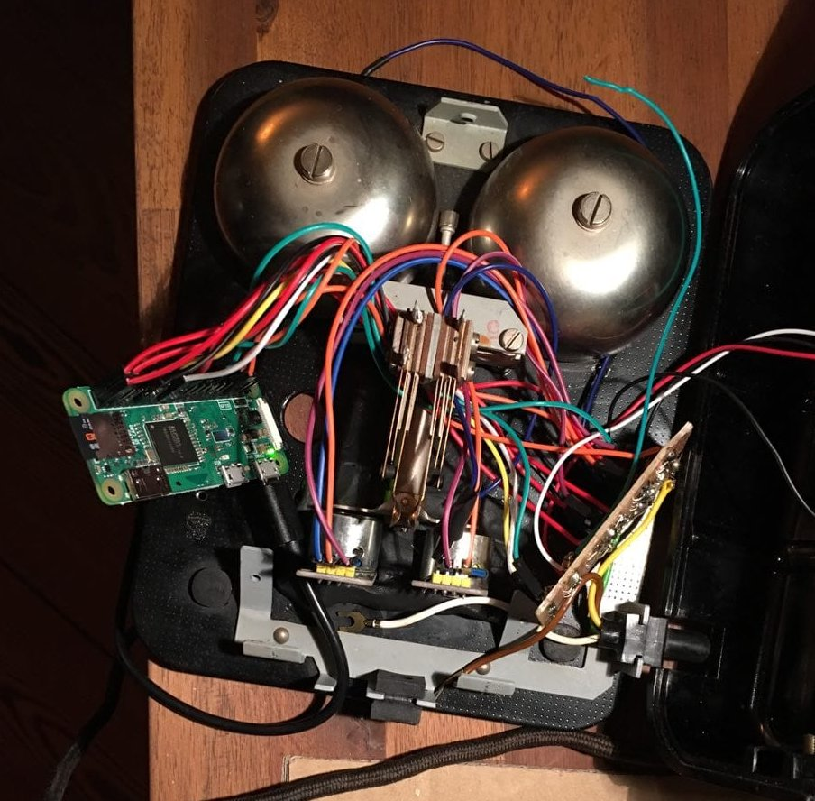

Optionphone
===========

Build a IoT Telephone using a classical [W49][2] Rotary dialphone.
The project for the final exhibition of my wife's communications design study. 

# Hardware
1. [Raspi Zero W][1] I fried one model because of a cheap soldering iron, for second try i used the model with pre soldered headers.

2. The [W49][2]

3. For ringing the bell i used two Keystudio 5V [electric magnets][5]
4. A [proper][3] soldering iron, i choose the Weller after my 30y old iron fried the first raspi.

5. a [third hand][4] is mandatory, you should have one with a good stand.

# The Circut

After assembling

The magnets are fixated using [fimo][6] due to the lack of a proper 3d printer.

Find details about the parts in the circut in the [freetz sketch][7]

# Setup 
To prepare the Raspi we need to activate GPIO Audio out. This [guide][8] has the details.

To ensure the GPIO alt function i simply added a crontab entry
`@reboot /usr/local/bin/gpio_alt -p 18 -f 5`

## Wifi 
you should setup a proper wpa_supplicant.conf to activate the webinterface.

load the systemd service files into `/usr/lib/systemd/system`
and activate them.

`systemctl enable option-player web`

## Soundboard
put your files into the `sounds`dir and edit the `telephonebook.txt` file
A nice source for soundfiles is the [asterisk][10] collection.

# Features
- Ring the phone via web interface and play a default soundfile
- Play a sound via the 4 digit code from telephonebook when dialing it.
- Text to Speech via AWS Polly (Not released yet)

# Known issues

The free line tone will play everytime the handset gets picked up. Even if the phone rings. 
To disable that just comment out Lines `29` and `30` in [player.py][9]

[1]:https://amzn.to/2VQizrL
[2]:https://de.wikipedia.org/wiki/W49
[3]:https://amzn.to/2CdpP9M
[4]:https://amzn.to/2XLcONQ
[5]:https://amzn.to/2EZwxSr
[6]:https://amzn.to/2NU5afJ
[7]:optionphone.fzz
[8]:https://learn.adafruit.com/adding-basic-audio-ouput-to-raspberry-pi-zero/pi-zero-pwm-audio
[9]:player.py#L29
[10]:https://downloads.asterisk.org/pub/telephony/sounds/